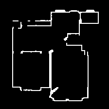
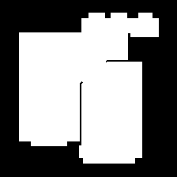
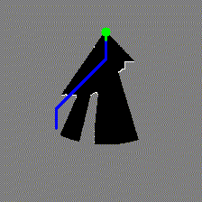
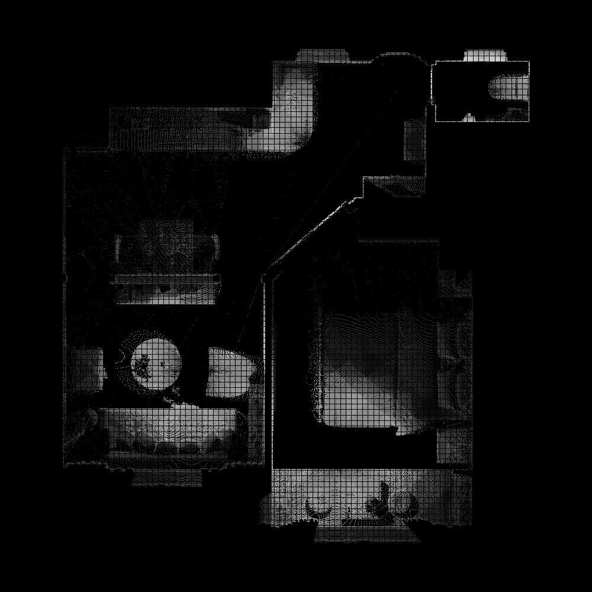

# Data Setup, Generation and Preprocessing

<!-- TABLE OF CONTENTS -->
<details open="open" style='padding: 10px; border-radius:5px 30px 30px 5px; border-style: solid; border-width: 1px;'>
  <summary>Table of Contents</summary>
  <ol>
  <li>
      <a href="#dataset-download">Dataset Download</a>
    </li>
    <li>
      <a href="#occupancy-generation">Occupancy Generation</a>
    </li>
    <li>
      <a href="#geosem-map-generation">GeoSem Map Generation</a>
    </li>
    <li>
      <a href="#training-utils">Training Utils</a>
    </li>
    <li>
      <a href="#visualizing-geometric-transformations-on-geosem-maps">Visualizing Geometric Transformations</a>
    </li>
    <li>
      <a href="#testing-the-dataloaders">Testing Dataloaders</a>
    </li>
  </ol>
</details>

## Dataset Download
We are using the Structured3D dataset for training and evaluation of the Foresight-Nav method for the task of PointNav and ObjectNav. For PointNav, we use occupancy masks only, and for ObjectNav we use GeoSem Maps (Occupancy + Semantics). 

Before proceeding, please set the following environment variables in your terminal:

```bash
export DATA_DIR=/path/to/your/data
export SCENE_DIR="${DATA_DIR}/Structured3D"
export UTILS_DIR="${DATA_DIR}/training_utils"
```

To download the Structured3D dataset, please use the [scripts/download_structured3d.sh](scripts/download_structured3d.sh) script. This will download the dataset and unzip it to the specified directory (`$DATA_DIR`). Make sure to change the URL for the Structured3D dataset in [`datagen_imagination/download_struct3d.py`](datagen_imagination/download_struct3d.py) after following the instructions for Structured3D dataset download [here](https://github.com/bertjiazheng/Structured3D?tab=readme-ov-file#data).

After downloading the dataset, the directory structure should look like this:

```bash
ForeSightDataset
├── zips
│   ├── Structured3D_panorama_00.zip
│   .
│   .
│   └── Structured3D_panorama_17.zip
└── Structured3D
    ├── scene_00000
    │   ├── 2D_rendering
    │   │   ├── 485142
    │   │   │   └── panorama
    │   │   │       ├── camera_xyz.txt
    │   │   │       ├── simple
    │   │   │       │   ├── rgb_warmlight.png
    │   │   │       │   ├── albedo.png
    │   │   │       │   ├── rgb_coldlight.png
    │   │   │       │   ├── semantic.png
    │   │   │       │   ├── depth.png
    │   │   │       │   ├── rgb_rawlight.png
    │   │   │       │   └── normal.png
    │   │   │       ├── full
    │   │   │       │   ├── rgb_warmlight.png
    │   │   │       │   ├── albedo.png
    │   │   │       │   ├── rgb_coldlight.png
    │   │   │       │   ├── semantic.png
    │   │   │       │   ├── depth.png
    │   │   │       │   ├── rgb_rawlight.png
    │   │   │       │   └── normal.png
    │   │   │       ├── empty
    │   │   │       │   ├── rgb_warmlight.png
    │   │   │       │   ├── albedo.png
    │   │   │       │   ├── rgb_coldlight.png
    │   │   │       │   ├── semantic.png
    │   │   │       │   ├── depth.png
    │   │   │       │   ├── rgb_rawlight.png
    │   │   │       │   └── normal.png
    │   │   │       └── layout.txt
    │   │   ├── 485145
    │   │   ├── 490854
    │   │   └── 492165
    │   └── annotation_3d.json
    ├── scene_00001
    ├── scene_00002
    .
    .
    └── scene_03500
```

## Occupancy Generation

We can now generate occupancy maps for the scenes in the Structured3D dataset using the [scripts/occupancy_datagen.sh](scripts/occupancy_datagen.sh) script. After running the script, for each scene we will have:
- `point_cloud.ply`: The point cloud of the scene generated from the 2D renderings. This is used to generate the occupancy map.
- `gt_occupancy_map.png`: The ground truth occupancy map for the scene constructed from Structured3D polygon annotations. We will use this as an interior-exterior mask during training and agent simulation to ensure it stays within the scene.
- `occupancy_map.png`: The occupancy map generated by a top-down projection of the pointcloud followed by post-processing to remove noise and fill holes. This is the occupancy map that will be used for training the imagination module (for PointNav and ObjectNav).
- `map_data.pkl`: The occupancy map resolution and other details like interior waypoints for agent simulation.
- `simulated_maps`: A directory containing simulated occupancy maps for the scene. These are generated by simulating an agent in the scene and generating occupancy maps at different time steps. The simulated maps are used to train the imagination module to generate partial occupancy maps / GeoSemMaps for the scene.

The directory structure after running the occupancy generation script will look like this:

```bash
ForeSightDataset
├── zips
└── Structured3D
    ├── scene_00000
    │   ├── gt_occupancy_map.png
    │   ├── point_cloud.ply
    │   ├── map_data.pkl
    │   ├── occupancy_map.png
    │   ├── 2D_rendering
    │   ├── simulated_maps
    │   │   ├── initial_map.png
    │   │   ├── 20.png
    │   │   ├── 40.png
    │   │   ├── 60.png
    │   │   ├── 80.png
    │   │   ├── 100.png
    │   │   └── 120.png
    ├── scene_00001
    ├── scene_00002
    .
    .
    ├── scene_03500
    ├── scene_list_train_occ.txt
    ├── scene_list_val_occ.txt
    └── scene_list_occ.txt
```

Outputs of an example occupancy map generation for a scene are shown below:

<!-- Centered image row with captions using a table -->
<div align="center">
  <table>
    <tr>
      <td align="center">
        <br>
        <sub>Occupancy Map</sub>
      </td>
      <td align="center">
        <br>
        <sub>Groundtruth Interior-Exterior Mask</sub>
      </td>
      <td align="center">
        <br>
        <sub>Scene Point Cloud</sub>
      </td>
      <td align="center">
        <br>
        <sub>Agent Simulation</sub>
      </td>
    </tr>
  </table>
</div>


## GeoSem Map Generation

<p align="center">
  <a href="">
    
  </a>
</p>

We generate GeoSem Maps from Panoramic RGBD data available in the Structured3D dataset using the [scripts/geosem_datagen.sh](scripts/geosem_datagen.sh) script. After running the script, each valid scene must have a `GeoSemMap` directory containing the following files:
- `clipfeat_map.npy`: The CLIP features for the scene in BEV map, the same resolution as the occupancy map. This stores the semantic information of the scene.
- `vis`: A directory containing visualizations of the GeoSem map. This includes the top-down color map, obstacle map, density map and clipfeat map.

The directory structure after running the GeoSem map generation script will look like this:

```bash
ForeSightDataset
├── zips
├── Structured3D
│   ├── scene_00000
│   │   ├── gt_occupancy_map.png
│   │   ├── point_cloud.ply
│   │   ├── map_data.pkl
│   │   ├── occupancy_map.png
│   │   ├── 2D_rendering
│   │   ├── simulated_maps
│   │   ├── GeoSemMap
│   │   │   ├── vis
│   │   │   │   ├── top_down_map.png
│   │   │   │   ├── obstacle_map.png
│   │   │   │   ├── density_map.png
│   │   │   │   └── clipfeat_map.png
│   │   │   ├── weight.npy
│   │   │   ├── clipfeat_map.npy
│   │   │   ├── obstacles.npy
│   │   │   ├── vis_obs.npy
│   │   │   └── color_top_down.npy
│   ├── scene_00001
│   ├── scene_00002
│   .
│   .
│   ├── scene_03500
│   ├── scene_list_train_occ.txt
│   ├── scene_list_val_occ.txt
│   ├── scene_list_occ.txt
│   ├── scene_list_train_geosem_map.txt
│   ├── scene_list_val_geosem_map.txt
│   └── scene_list_geosem_map.txt
└── imagination_training_data
    ├── scene_00000
    ├── scene_00001
    ├── scene_00002
    .
    .
    └── scene_03500
```

An example of the generated GeoSem map is shown below:.

<!-- Centered image row with captions using a table -->
<div align="center">
  <table>
    <tr>
      <td align="center">
        <br>
        <sub>Top-Down Color Map</sub>
      </td>
      <td align="center">
        <br>
        <sub>Density Map</sub>
      </td>
      <td align="center">
        <br>
        <sub>GeoSem Map (Top-Down Semantic Segmentation)</sub>
      </td>
    </tr>
  </table>
</div>


## Training Utils

To facilitate training and evaluation of the imagination module, we also generate some training utils using the [scripts/prepare_training_utils.sh](scripts/prepare_training_utils.sh) script. This includes generating:
- `mp3d_text_feats.npy`: The CLIP features for the Matterport3D semantic categories, for visualization of the top-down semantic segmentation of the GeoSem map.
- `category_frequency.npy`: The frequency of each category in the training set. This is used for weighing the cosine similarity loss during training, an ablation which we refer to as the `category_cosine_similarity` loss.

The final `$DATA_DIR` directory structure must look like this:

```bash
ForeSightDataset
├── zips
├── Structured3D
│   ├── scene_00000
│   .
│   .
│   └── scene_03500
├── imagination_training_data
│   ├── scene_00000
│   .
│   .
│   └── scene_03500
└── training_utils
    ├── mp3d_text_feats.npy
    └── category_frequency.npy
```

## Visualizing Geometric Transformations on GeoSem Maps

To visualize the geometric transformations applied to the GeoSem maps during training, use the [`check_map_transforms`](datagen_imagination/geosem_map_generation/check_map_transforms.py) script. This will generate visualizations of the GeoSem map with different transformations applied (rotation and scaling).

```bash
$ mkdir vis
$ python -m datagen_imagination.geosem_map_generation.check_map_transforms \
    --root_path="${DATA_DIR}/Structured3D/scene_00000/GeoSemMap" \
    --text_feat_path="${DATA_DIR}/training_utils/mp3d_text_feats.npy" \
    --vis_path=vis \
    --rotation=30 \
    --scale=0.5
```

## Testing the DataLoaders

We use the [dataloader/geosem_dataloader.py](dataloader/geosem_dataloader.py) for loading of GeoSemMaps for training the imagination module for ObjectNav, and [dataloader/occ_dataloader.py](dataloader/occ_dataloader.py) for loading of occupancy maps for training the imagination module for PointNav. You can test the dataloaders by simply running them as modules.

```bash
$ python -m dataloader.geosem_dataloader
$ python -m dataloader.occ_dataloader
```

A `tmp` directory will be created in the current directory, and the dataloaders will generate a few batches of data and visualize and save them in the `tmp` directory. 
