<p align="center">
  <h2 align="center"> ForesightNav: Learning Scene Imagination for Efficient Exploration </h2>
  <p align="center">
    <a href="https://hardik01shah.github.io/">Hardik Shah</a><sup>1</sup>
    .
    <a href="https://jiaxux.ing/">Jiaxu Xing</a><sup>2</sup>
    .
    <a href="https://messikommernico.github.io/">Nico Messikommer</a><sup>2</sup>
    .
    <a href="https://boysun045.github.io/boysun-website/">Boyang Sun</a><sup>1</sup>
    .
    <a href="https://people.inf.ethz.ch/marc.pollefeys/">Marc Pollefeys</a><sup>1, 3</sup>
    .
    <a href="https://rpg.ifi.uzh.ch/people_scaramuzza.html">Davide Scaramuzza</a><sup>2</sup>
  </p>
  <p align="center"> <strong>Computer Vision And Pattern Recognition(CVPR) Workshop 2025 - <a href="https://opensun3d.github.io/">OpenSun3D</a></strong></p>
  <p align="center">
    <sup>1</sup>ETH Zürich · <sup>2</sup>University of Zürich · <sup>3</sup>Microsoft Spatial AI Lab
  </p>
  <h3 align="center">

 <!-- [](-) -->
 [](https://rpg.ifi.uzh.ch/docs/CVPRW25_Shah.pdf)
 [](https://opensource.org/license/gpl-3-0)
 <div align="center"></div>
</p>

<p align="center">
  <a href="">
    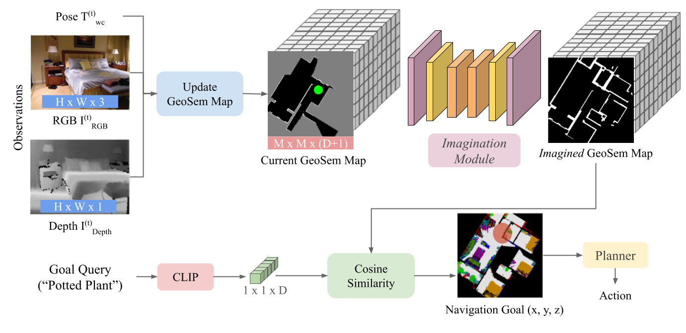
  </a>
</p>

## 📃 Abstract
Understanding how humans leverage prior knowledge to navigate unseen environments while making exploratory decisions is essential for developing autonomous robots with similar abilities. In this work, we propose **ForesightNav**, a novel exploration strategy inspired by human imagination and reasoning. Our approach equips robotic agents with the capability to predict contextual information, such as occupancy and semantic details, for unexplored regions. These predictions enable the robot to efficiently select meaningful long-term navigation goals, significantly enhancing exploration in unseen environments. We validate our imagination-based approach using the Structured3D dataset, demonstrating accurate occupancy prediction and
superior performance in anticipating unseen scene geometry. Our experiments show that the imagination module improves the efficiency of exploration in unseen environments, achieving a 100% completion rate for PointNav and an SPL of 67% for ObjectNav on the Structured3D Validation split. These contributions demonstrate the power of imagination driven reasoning for autonomous systems to enhance generalizable and efficient exploration

# :hammer_and_wrench: Installation
The code has been tested on: 
```yaml
Ubuntu: 20.04 LTS
Python: 3.12.3
CUDA: 12.6
GPU: Tesla T4 (for inference), A100 (for training)
```

## 📦 Setup

Clone the repo and setup as follows:

```bash
$ git clone git@github.com:uzh-rpg/foresight-nav.git
$ cd foresight-nav
$ conda env create -f req.yml
$ conda activate foresight
```

Since we use the ViT models from the [mae](https://github.com/facebookresearch/mae) repository, it requires an older version of timm. Fix the timm install by changing the `torch._six` import to `collections.abc` as directed in this [issue](https://github.com/huggingface/pytorch-image-models/pull/421/commits/94ca140b67cb602ee7e146af32bfb63b60df96f4).

# :arrow_down: Data


#### Checkpoints
We provide all required checkpoints [here](https://polybox.ethz.ch/index.php/s/xwCrnP9mk4AJDYS). Download the checkpoints and place them in the `checkpoints` directory. The directory structure should look like this:

```bash
foresight-nav
└── checkpoints
    ├── objectnav
    │   ├── unet_cosine_sim.pth
    │   └── unet_category_cosine_sim.pth
    └── LSeg
        └──lseg_checkpoint.pth
```

#### Structured3D Data Preparation
See [DATA.MD](DATA.md) for detailed instructions on data download, preparation and preprocessing. Bash scripts are provided to download and prepare the data. Change the `DATA_DIR` variable in the scripts to your desired data directory, and add the url for the Structured3D dataset in [`datagen_imagination/download_struct3d.py`](datagen_imagination/download_struct3d.py) after following the instructions for Structured3D dataset download [here](https://github.com/bertjiazheng/Structured3D?tab=readme-ov-file#data).

Set your enviornment variables with:
```bash
export DATA_DIR=/path/to/your/data
export SCENE_DIR="${DATA_DIR}/Structured3D"
export UTILS_DIR="${DATA_DIR}/training_utils"
```

```bash
$ bash scripts/download_structured3d.sh
$ bash scripts/occupancy_datagen.sh
$ bash scripts/geosem_datagen.sh
$ bash scripts/prepare_training_utils.sh
```
The above scripts will download the Structured3D dataset and generate the occupancy maps and GeoSem maps. Below is a visualization of the generated maps for a scene in the Structured3D dataset. 

<div align="center">
  <table>
    <tr>
      <td align="center">
        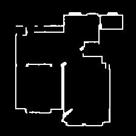<br>
        <sub>Occupancy Map</sub>
      </td>
      <td align="center">
        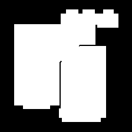<br>
        <sub>Groundtruth Interior-Exterior Mask</sub>
      </td>
      <td align="center">
        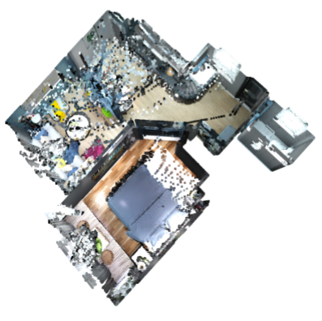<br>
        <sub>Scene Point Cloud</sub>
      </td>
      <td align="center">
        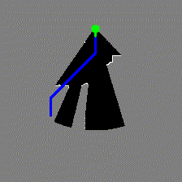<br>
        <sub>Agent Simulation</sub>
      </td>
    </tr>
  </table>
</div>

<div align="center">
  <table>
    <tr>
      <td align="center">
        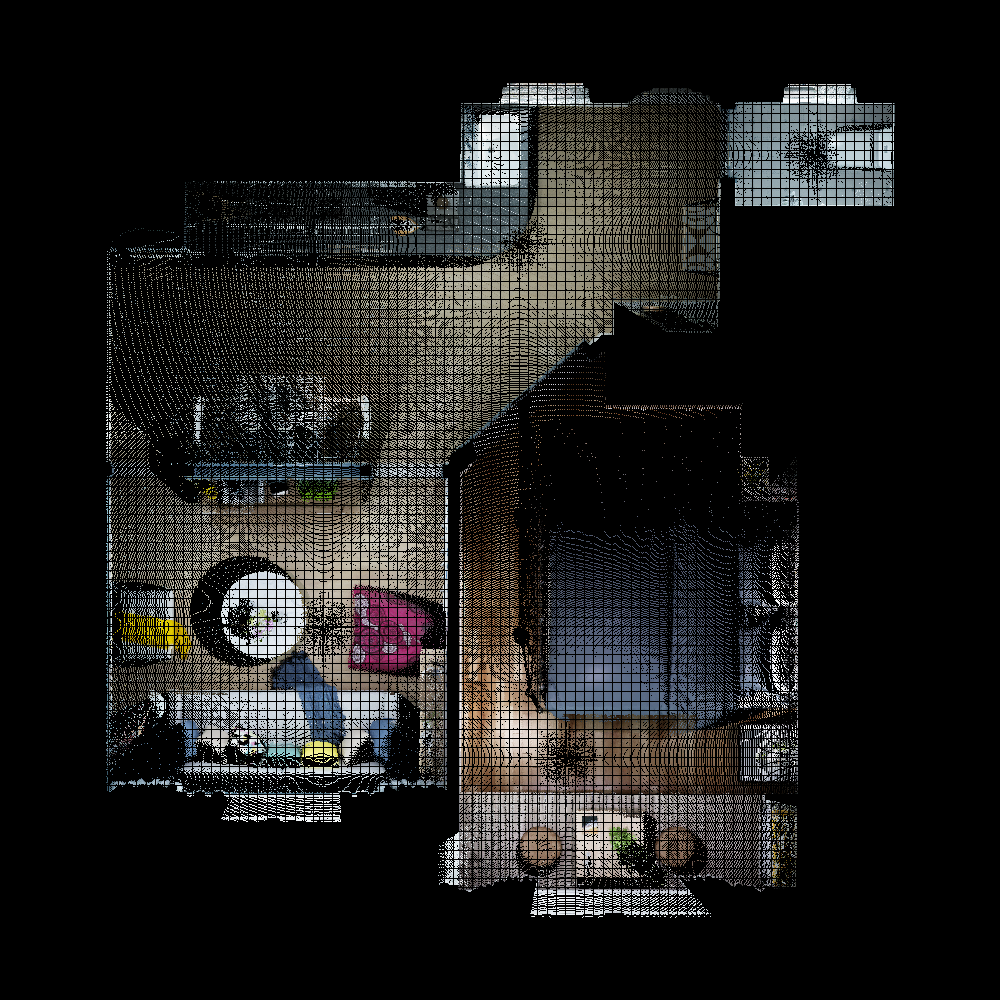<br>
        <sub>Top-Down Color Map</sub>
      </td>
      <td align="center">
        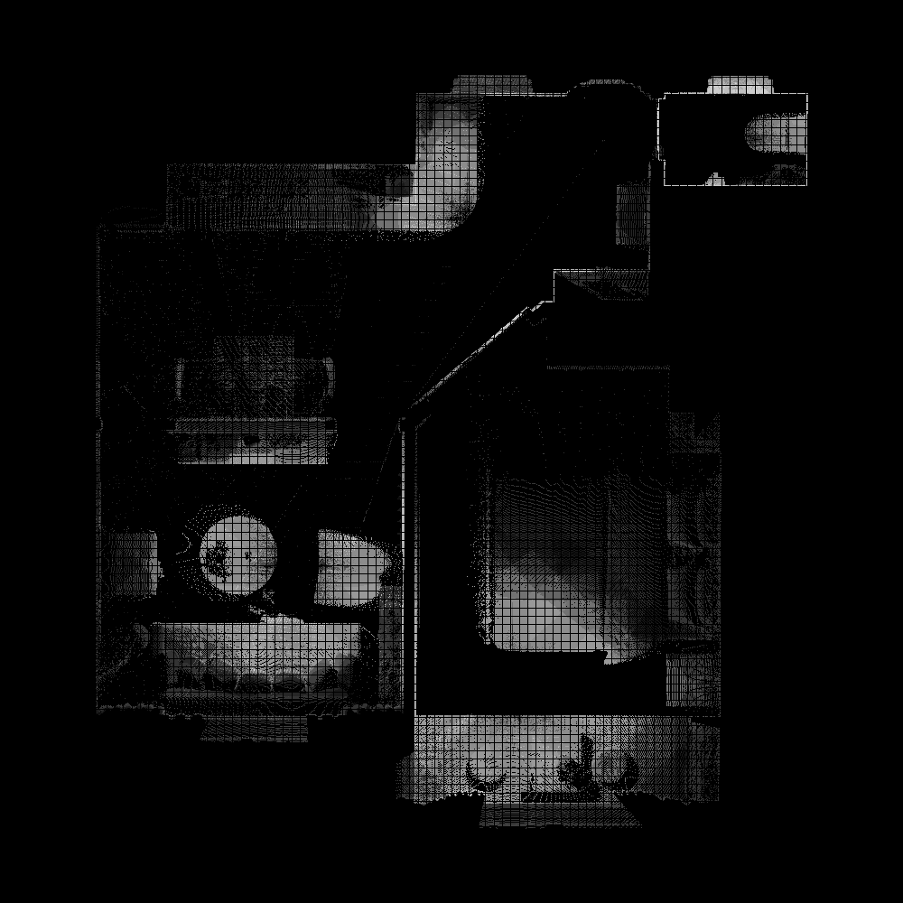<br>
        <sub>Density Map</sub>
      </td>
      <td align="center">
        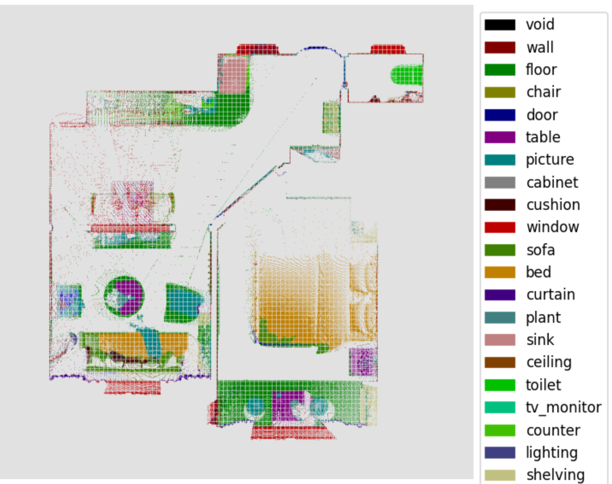<br>
        <sub>GeoSem Map (Top-Down Semantic Segmentation)</sub>
      </td>
    </tr>
  </table>
</div>

# :rocket: Querying GeoSem Maps using Language Queries

The generated GeoSem Maps can be used to localize objects in the scene using language queries. We provide a script to visualize the localization of the query on the GeoSem map. Running the following command will prompt the user to enter a language query, and the script will visualize the localization of the query on the GeoSem map. Results will be saved in the
specified directory.


```bash
$ mkdir ./langq_geosem
$ python -m datagen_imagination.geosem_map_generation.viz_openlang_heatmap \
  --root_path="${SCENE_DIR}/scene_00000/GeoSemMap" \
  --vis_path=./langq_geosem
```

<div align="center">
  <table>
    <tr>
      <td align="center">
        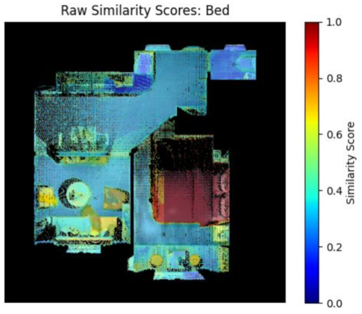<br>
        <sub>Raw Similarity Score Visualization as a Heatmap</sub>
      </td>
      <td align="center">
        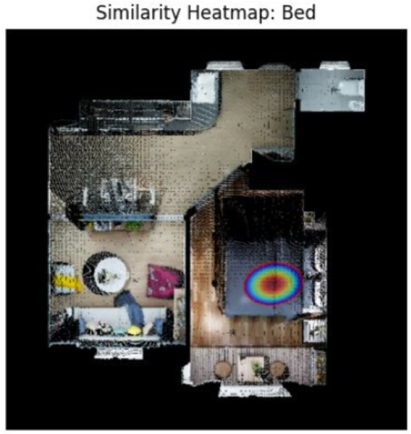<br>
        <sub>Localization of the Query after processing raw scores</sub>
      </td>
    </tr>
  </table>
</div>


<div align="center">
  <table>
    <tr>
      <td align="center">
        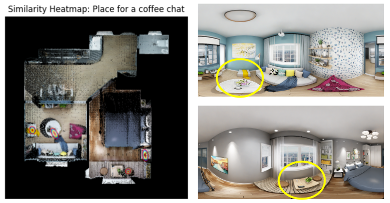<br>
        <sub>Localization of an OpenVocabulary Query</sub>
      </td>
    </tr>
  </table>
</div>


# :weight_lifting: Training and Inference 

We used the training script from the [mae](https://github.com/facebookresearch/mae/blob/main/main_pretrain.py) repository for training the imagination module. We have not released this yet since the mae code is licensed under a different license. We are migrating this training code to a new training setup and will release it soon! Losses, metrics and logging are already available in [train_utils](train_utils/).

For evaluating the imagination models in an ObjectNav task on the Structured3D validation scenes, use the following command:

```bash
$ python -m evaluation.evaluate_imagine --conf='configs/evaluation_conf.yaml'
```

Performance of the agent is logged to wandb as the evaluation progresses, and per-scene and per-object-category metrics can be analysed in realtime. Make sure to change the `wandb.init()` call in [evaluation/evaluate_imagine.py](evaluation/evaluate_imagine.py) with an appropriate entity/project name. Below is an example of a logged image showing a topdown view of the scene with the trajectories of different agents exploring for locating a 'TV'

<!-- 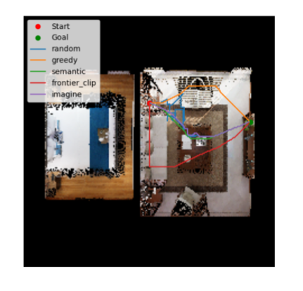 -->
<p align="center">
  <a href="">
    
  </a>
</p>


## 🚧 TODO List
- [x] Release data generation code
- [x] Release ObjectNav models and evaluation code
- [ ] Release training code
- [ ] Release PointNav models and evaluation code (Using just occupancy prediction)

## 📧 Contact
If you have any questions regarding this project, please use the github issue tracker or contact [Hardik Shah](mailto:hardik01shah@gmail.com).

# :pray: Acknowledgements
We thank the authors from [Structured3D](https://github.com/bertjiazheng/Structured3D), [RoomFormer](https://github.com/ywyue/RoomFormer), [VLMaps](https://github.com/vlmaps/vlmaps) and [mae](https://github.com/facebookresearch/mae) for open-sourcing their codebases. We also thank the authors of [CrossOver](https://github.com/GradientSpaces/CrossOver) for this README template!


# :page_facing_up: Citation

If you find this work and/or code useful, please cite our paper:
```bibtex
@inproceedings{shah2025foresightnav,
  title={ForesightNav: Learning Scene Imagination for Efficient Exploration},
  author={Shah, Hardik and Xing, Jiaxu and Messikommer, Nico and Sun, Boyang and Pollefeys, Marc and Scaramuzza, Davide},
  booktitle = {Proceedings of the IEEE/CVF Conference on Computer Vision and Pattern Recognition Workshops (CVPRW)},
  year={2025}
}
```